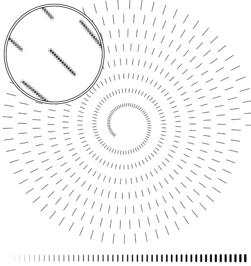
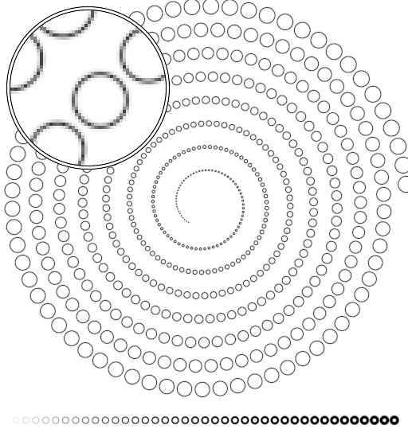
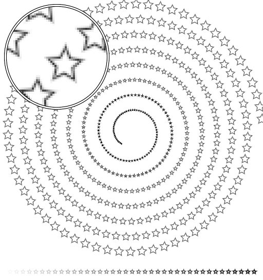
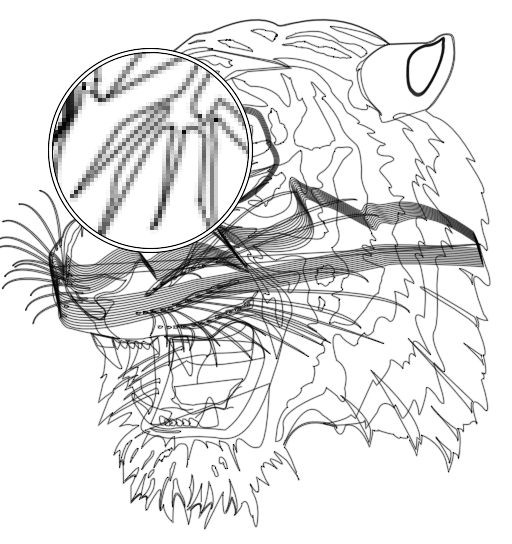

OpenGL Anti-Grain Geometry (gl-agg)
===================================

This is a repository for gathering different experiments related to
high-quality rendering of 2D graphics using OpenGL (including lines, path,
circles, arcs, ellipses, bézier curves, polygon, dash patterns, etc.).

Lines
-----

Circles
-------

Path
----

